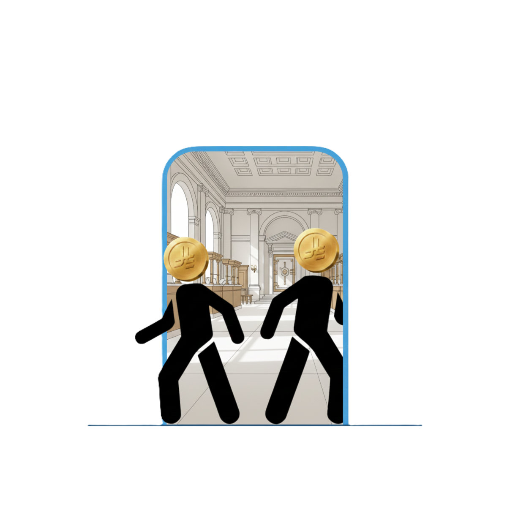

# Churn Control

  

**Churn Control** is a customer churn prediction project that helps businesses identify customers at risk of leaving. The project leverages machine learning models to predict churn probabilities and provide actionable insights.

---

## Table of Contents
- [Project Overview](#project-overview)
- [Features](#features)
- [Usage](#usage)
- [Data](#data)

---

## Project Overview
Churn Control is designed to give businesses actionable insights into customer retention. The project includes:

- Data preprocessing and feature engineering
- Machine learning model training and evaluation
- An interactive Streamlit app for making predictions and visualizing results

The goal is to help businesses proactively reduce churn and improve customer satisfaction.

---

## Features
- Upload customer data and receive churn probability predictions
- Visualize feature importance using SHAP plots
- Interactive dashboard to monitor customer churn risk
- Modular and easy-to-extend code structure

## Usage
To launch the Streamlit app:
run "streamlit run app.py" using terminal

## Data
Original data sourced from:
https://www.kaggle.com/datasets/sandiledesmondmfazi/bank-customer-churn
